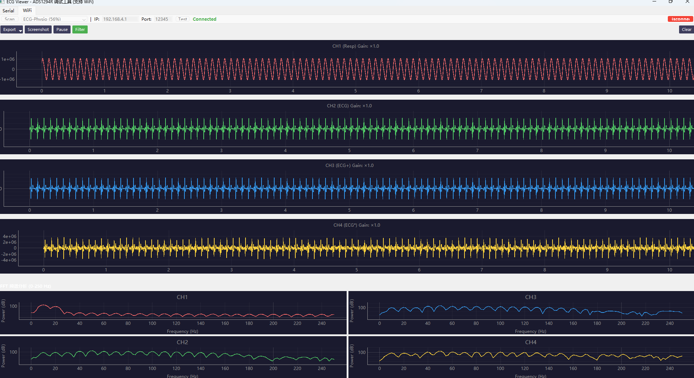

# PHYSIO FOR RODENT - 啮齿动物生理信号监测系统

[](README_CN.md) [](README_EN.md)

专为啮齿动物（大鼠/小鼠）设计的多参数生理信号监测系统，支持 ECG、呼吸、SPO2、温度和血压测量。

---

## 📊 系统框图

```
                    ┌─────────────────────────────────────────────────────────────────────────┐
                    │                      生理信号监测系统 (PHYSIO)                              │
                    │                         STM32F429ZGT6 主控                                │
                    └─────────────────────────────────────────────────────────────────────────┘
                                            ▲                    ▲
                                            │ UART               │ WiFi (ESP32)
                    ┌─────────────────────────────────────────────────────────────────────────┐
                    │  ┌─────────────┐    ┌───────────────────────────────────┐    ┌─────────┐│
   生理信号 ────────│  │ ADS1298R    │    │          STM32F429ZGT6            │    │ ESP32   ││───► WiFi
   (ECG/Resp)       │  │ ECG+Resp    │SPI │                                   │UART│ WiFi    ││    传输
                    │  │ 采集芯片    │────│  • SPI 接口 (ADS1298R/MAX31856)   │────│ 模块    ││
                    │  └─────────────┘    │  • I2C 接口 (TMP117/AFE4490)      │    └─────────┘│
                    │                     │  • DAC 输出 (PID 温控)            │               │
   血氧 ────────────│  ┌─────────────┐    │  • UART 数据传输                  │               │
   (SPO2)           │  │ AFE4490     │I2C │                                   │               │
                    │  │ SPO2 采集   │────│  ┌───────────────────────────┐    │               │
                    │  └─────────────┘    │  │    PID 温度控制算法        │    │               │
                    │                     │  │    ECG/Resp 信号处理       │    │               │
   温度 ────────────│  ┌─────────────┐    │  │    SPO2 计算算法           │    │               │
   (体温)           │  │ TMP117      │I2C │  │    数据打包/传输           │    │               │
                    │  │ 温度传感器  │────│  └───────────────────────────┘    │               │
                    │  └─────────────┘    │                                   │               │
                    │                     │  ┌─────────┐    ┌─────────────┐   │               │
   热电偶 ──────────│  ┌─────────────┐    │  │ DAC     │    │ PWM 输出    │   │               │
   (动物体温)       │  │ MAX31856    │SPI │  │ 温控输出│    │ 时钟信号    │   │               │
                    │  │ 热电偶接口  │────│  └─────────┘    └─────────────┘   │               │
                    │  └─────────────┘    │                                   │               │
                    │                     └───────────────────────────────────┘               │
                    │  ┌─────────────┐                                                        │
   加热器 ──────────│  │ PNP Heater  │──────────────────────────────────────────────────────│───► 维持体温
   (温度维持)       │  │ PCB 加热板  │                                                        │
                    │  └─────────────┘                                                        │
                    └─────────────────────────────────────────────────────────────────────────┘
                                            │ UART/USB
                                            ▼
                    ┌─────────────────────────────────────────────────────────────────────────┐
                    │                      Python 控制台软件                                   │
                    │  ┌─────────────────────────────────────────────────────────────────────┐│
                    │  │  • 4 通道 ECG 波形显示          • 实时 FFT 频谱分析                  ││
                    │  │  • 呼吸波形显示                  • 心率/呼吸率计算                    ││
                    │  │  • 温度监测                      • PID 温度控制                       ││
                    │  │  • 数据保存 (CSV)               • WiFi/串口双模式通信                ││
                    │  └─────────────────────────────────────────────────────────────────────┘│
                    └─────────────────────────────────────────────────────────────────────────┘
```

---

## 📁 项目结构

```
ECG-physio/
├── 1.HW/                           # 硬件设计文件
│   ├── PHYSIO_PCB.jpg              # 主板 PCB 设计
│   ├── PNP_HEATER_PCB.jpg          # 加热板 PCB 设计
│   └ (原理图/网表因保密要求不公开，仅提供 PCB 图片)
├── 2.MATLAB/                       # MATLAB 算法验证
│   ├── ECG.m                       # ECG 信号处理脚本
│   └── pan1985.pdf                 # Pan-Tompkins 算法参考
├── 3.FIRMWARE/                     # 固件代码
│   ├── 1.ST MCU/                   # STM32F429 固件
│   │   └── Physio/                 # STM32CubeIDE 工程
│   │       ├── Core/               # 核心代码
│   │       │   ├── Inc/            # 头文件
│   │       │   └── Src/            # 源文件
│   │       │       ├── ADS1298R.c  # ADS1298R 驱动
│   │       │       ├── PID.c       # PID 温控算法
│   │       │       ├── MAX31856drv.c # 热电偶驱动
│   │       │       └── main.c      # 主程序
│   │       └── Drivers/            # STM32 HAL 库
│   └── 2.ESP32/                    # ESP32 WiFi 模块固件
├── 4.Python_console/               # Python 控制台软件
│   ├── V1/                         # 版本 1 (基础版)
│   │   ├── main.py                 # 主程序
│   │   └── phsio.py                # 信号处理
│   └── V2/                         # 版本 2 (增强版)
│       ├── main.py                 # 主程序入口
│       ├── ui/                     # UI 组件
│       ├── comms/                  # 通信模块 (串口/WiFi)
│       ├── signal_processing/      # 信号处理算法
│       ├── data/                   # 数据处理
│       └── utils/                  # 工具函数
└── README.md                       # 项目说明
```

---

## 🔧 硬件要求

| 组件 | 型号 | 说明 |
|------|------|------|
| 主控 MCU | STM32F429ZGT6 | 180MHz, 1MB Flash, 256KB RAM |
| ECG+Resp 芯片 | ADS1298R | 8 通道 24 位 ADC, 内置呼吸测量 |
| SPO2 芯片 | AFE4490 | 脉搏血氧测量前端 |
| 温度传感器 | TMP117 | 高精度数字温度传感器 |
| 热电偶接口 | MAX31856 | 热电偶数字转换器 |
| WiFi 模块 | ESP32 | WiFi 数据传输 |
| 加热板 | PNP Heater PCB | 维持动物体温 |

---

## 📋 功能特性

### 硬件功能
- **ECG 采集** - 4 通道心电图信号采集，24 位精度
- **呼吸监测** - 阻抗法呼吸波形测量
- **SPO2 测量** - 脉搏血氧饱和度监测
- **温度监测** - 体温和环境温度测量
- **PID 温控** - 自动加热维持动物体温
- **血压测量** - 有创血压信号采集 (开发中)
- **数据传输** - WiFi 和串口双模式输出

### 软件功能 (Python 控制台)
- **实时波形显示** - 4 通道 ECG + 呼吸波形
- **FFT 频谱分析** - 0-250Hz 实时频谱
- **心率检测** - Pan-Tompkins R 波检测算法
- **呼吸率检测** - 阻抗呼吸波形分析
- **数字滤波** - 50Hz 陷波、带通滤波
- **数据保存** - CSV 格式导出
- **WiFi 支持** - 远程数据传输

---

## 🚀 快速开始

### 硬件准备
1. 组装 PHYSIO PCB 主板
2. 连接 ADS1298R ECG 采集模块
3. 连接 TMP117/MAX31856 温度传感器
4. 连接加热板 (用于体温维持)
5. 连接 ESP32 WiFi 模块 (可选)

### 固件编译
1. 使用 STM32CubeIDE 打开 `3.FIRMWARE/1.ST MCU/Physio`
2. 编译并下载到 STM32F429
3. ESP32 固件使用 Arduino IDE 编译

### Python 控制台
```bash
cd "4.Python_console/V2"
pip install -r requirements.txt
python main.py
```

---

## 📄 文档

| 文档 | 说明 |
|------|------|
| [硬件设计](1.HW/README.md) | PCB 和原理图说明 |
| [MATLAB 算法](2.MATLAB/README.md) | ECG 处理算法验证 |
| [Python 控制台](4.Python_console/V2/README.md) | 软件使用说明 |
| [烧录教程](3.FIRMWARE/FLASH_GUIDE.md) | 编译烧录联调全流程（STM32/ESP32/上位机） |

---

## 🛠️ 工具版本

- STM32CubeIDE 1.x
- STM32 HAL 库
- Python 3.8+
- PyQt5 5.15+
- Arduino IDE (ESP32)

---

## 📅 项目日期

- 初版发布：2023-10-21
- 更新版本：2025-09-23

---

## 📧 联系方式

如有问题，请提交 Issue 或联系项目维护者。

---

## 硬件原型


## Python 控制台


---

## 4 通道模拟 ECG 显示 (WiFi 模式)



**通道说明：**
| 通道 | 波形类型 | 说明 |
|------|----------|------|
| CH1 (Resp) | 呼吸波形 | 低频正弦波 (0.2Hz) |
| CH2 (ECG) | 标准 ECG | P-QRS-T 复合波 |
| CH3 (ECG+) | 增强 ECG | 幅度加大 50% |
| CH4 (ECG*) | 噪声 ECG | 带额外噪声的 ECG |